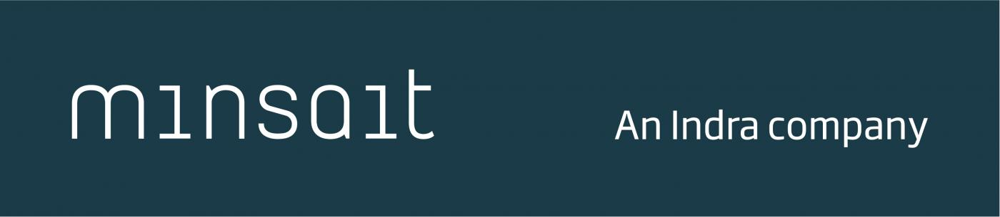

 

  

 

### Proposta

 

  

    O objetivo deste teste foi avaliar habilidades no desenvolvimento de aplicativos web usando o framework Angular. Os participantes foram desafiado a criar uma aplicação Angular que permite listar, cadastrar e editar produtos.
  

 

### Stack utilizada

 

  
    
  

 

### Utilização

 

<video width="320" height="240" controls>
  <source src="./JPs_frontend/src/assets/JPsAngular.mp4" type="video/mp4">
</video>
